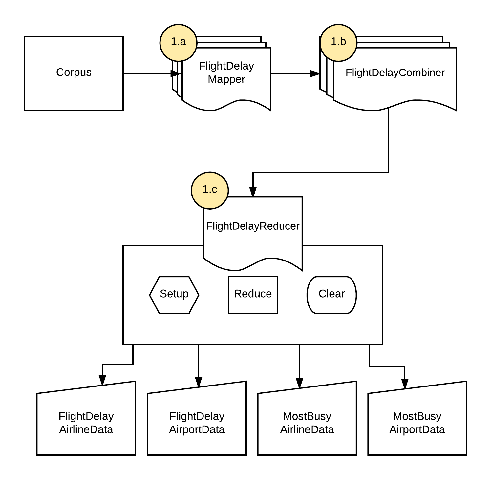

```{r setup, include=FALSE,echo=FALSE,results='hide',message=FALSE, warning=FALSE, cache=TRUE}
knitr::opts_chunk$set(echo = TRUE)
ipak <- function(pkg){
    new.pkg <- pkg[!(pkg %in% installed.packages()[, "Package"])]
    if (length(new.pkg)) 
        install.packages(new.pkg, dependencies = TRUE)
    sapply(pkg, require, character.only = TRUE)
}
packages <- c("kableExtra","ggplot2","gridExtra","dplyr","magrittr","ggplot2","scales","knitr","kableExtra")
# ipak(packages)
library(ggplot2)
library(gridExtra)
library(dplyr)
library(magrittr)
library(ggplot2)
library(scales)
library(knitr)
library(data.table)
library(kableExtra)
knitr::opts_knit$set(root.dir = normalizePath(getwd()))
```

\newpage

# Problem
We will explore the world of airline on-time performance data analysis. Your task will be to implement a pipeline that runs a set of pseudo distributed map reduce tasks to plot the mean delay of the five most active airlines and for the five most active airports in the country. Specifically, your code should take a set of data files as input and produce visualizations of delays. You are free to choose how to visualize delays, how many graphs you want to produce, etc. You will be asked to defend your choice.

# Solution

## Architecture {#architecture}

  

*Arrows head represent the data flow*


## 1. FlightDelayJob


### 1a. FlightDelayMapper
            
The mapper reads each line from flight record csv file, cleans data as per given sanity rules and generates two Composite `<K,V>` pair for airline and airport. The `key` is type of `FlightCountCompositeKey` class which implements `WritableComparable` interface while the `value` is type of `FlightDataWritable` class which implements `Writable` interface.
    

```
# FlightDelayMapper Input k,v
LongWritable, Text
# FlightDelayMapper Output k,v
FlightCountCompositeKey, FlightDataWritable
```
    
#### FlightCountCompositeKey
    
The structure of `FlightCountCompositeKey` is as shown below:
      
```java
public class FlightCountCompositeKey implements WritableComparable<FlightCountCompositeKey> {
  private IntWritable year;
  private IntWritable month;
  private IntWritable aaCode;
  private Text aaName;
  private IntWritable recordType; //1-Airport , 2-Airline
}
```
This class was created to avoid reading file twice.
Each input line of data contains information for both airline and airport. 
Hence, a mapper creates two instance of `FlightCompositeKey` and its corresponding value class `FlightDataWritable`.
The following table shows difference in fields for each composite key instance.
    
```{r, echo = FALSE,message=FALSE, warning=FALSE}
library(knitr)
library(kableExtra)
compositeDF <- read.csv("data/CompositeKeyCompare.csv")
kable(compositeDF) %>% kable_styling(bootstrap_options = "striped", full_width = F)
```
    
This class also overrides `compareTo` method in the following way
    
```java
  @Override
  public int compareTo(FlightCountCompositeKey key) {
    int code = this.year.compareTo(key.getYear());
    if (code == 0) {
      code = this.month.compareTo(key.getMonth());
      if (code == 0) {
        code = this.recordType.compareTo(key.getRecordType());
        if (code == 0) {
          code = this.getAaCode().compareTo(key.getAaCode());
        }
      }
    }
    return code;
  }
```
The overridden `compareTo` acts as both `SortComparator` and `GroupingComparator`. 

    
#### FlightDataWritable
    
The structure of `FlightCountCompositeKey` is as shown below:

```java
public class FlightDataWritable implements Writable {
// the value part of 1st map output pair <key, value>

FloatWritable delay;
IntWritable count;
}
```
The mapper class emits instance of this class as value to combiner/reducer. Each Value object contains two fields: `delay` and `count`. `delay` captures the normalized delay for airport/airline. `Count` is used to calculate globally active airport/airline, and it also contributes towards `mean delay`.
    
### 1.b FlightCountCombiner 
    
Combines on keys for both `count` and `delay`. As `FlightCountReducer` is set to single instance, the combiner helps to reduce the input, thus improving performance.

```
# FlightCountCombiner Input k,v
FlightCountCompositeKey, FlightDataWritable
# FlightCountCombiner Output k,v
FlightCountCompositeKey, FlightDataWritable
```
    
The `reduce` method of combiner receives `FlightCountCompositeKey` key and `Iterable<FlightDataWritable>` values, and as explained above, sums up totalDelay for each airline and airport for each year each month.
    
At the end of the combiner phase, we will have combined delay and count for each airline and airport for each year each month.

This process is shown below:
    
```{r, echo = FALSE, message=FALSE, warning=FALSE}
ckExample1 <- read.csv("data/ckExample_1.csv")
kable(ckExample1) %>% kable_styling(bootstrap_options = "striped", full_width = F)
```
    
As shown in the above table, there are four records, 2 each of type airport and airline. The data from the above table will be grouped on `FlightCountCompositeKey` and will be combined as shown below:
    
```{r, echo = FALSE, message=FALSE, warning=FALSE}
ckExample2 <- read.csv("data/ckExample_2.csv")
kable(ckExample2) %>% kable_styling(bootstrap_options = "striped", full_width = F)
```

    
### 1.c FlightCountReducer 
    
The Reducer phase receives input and emits output in the following `<k,v>` format

```
# FlightCountReducer Input k,v
FlightCountCompositeKey, FlightDataWritable
# FlightCountReducer Output k,v
FlightCountCompositeKey, FlightDataWritable
```
It has 3 sub phases:

- `Setup`: It initializes `topKCount` from job configuration, which is the value for the final top k flights for which we want to run the MR job.
- `Reduce`: The reduce phase works on the total following reducer local variables:

    ```{r, echo = FALSE, message=FALSE, warning=FALSE}
    varDesc <- read.csv("data/varDesc.csv")
    kable(varDesc) %>% kable_styling(bootstrap_options = "striped", full_width = F)
    ```
    It performs the following operations,

    * Reduces `count` and `delays`
    * Calcualtes `mean delays`
    * Stores `counts` in local map for global winner
    * Stores reduced `mean delays` in local map for filtered output.


- `Clear`: It performs the following operations,

    * Sort Global counts stored in local maps for Global winners.
    * Writes Global winners to file.
    * Filters reduced `mean delays` and writes to file.


## Outputs

The output is explained below,

* mostBusyAirportData-r-00000 :
    Data for top 5 most busy airports. Every row represents,
    ```
    <recordType=1>,<airportCode>
    ```
* mostBusyAirlineData-r-00000 :
    Data for top 5 most busy airline. Every row represents,
    ```
    <recordType=2>,<airlineCode>
    ```
* flightDelayAirportData-r-00000 :
    The final `mean delays` for airports. Data is aggregated on Year,Month,AirportCode for top 5 most busy airports. Every row represents,
    ```
    <year>,<month>,<airportCode>,<airportName>,<recordType=1>,<totalDelay>,<totalCount>
    ```
* flightDelayAirlineData-r-00000 :
     The final `mean delays` for airlines. Data is aggregated on Year,Month,AirlineCode for top 5 most busy airlines. Every row represents,
    ```
    <year>,<month>,<airlineCode>,<airlineName>,<recordType=2>,<totalDelay>,<totalCount>
    ```


# Output Data Analysis

```{r, echo=FALSE, include=TRUE}
library(ggplot2)
library(scales)
library(data.table)
df.airport <- fread("data/flightDelayAirportData-r-00000")
df.airline <- fread("data/flightDelayAirlineData-r-00000")
colnames(df.airport) <- c("year","month","code","name","type","delay")
colnames(df.airline) <- c("year","month","code","name","type","delay")
```

**Top 5 Busiest Airports**
    ```{r, echo = FALSE, message=FALSE, warning=FALSE}
    varDesc <- read.csv("data/top5BusyAirport.csv")
    kable(varDesc) %>% kable_styling(bootstrap_options = "striped", full_width = F)
    ```

**Top 5 Busiest Airlines**
    ```{r, echo = FALSE, message=FALSE, warning=FALSE}
    varDesc <- read.csv("data/top5BusyAirline.csv")
    kable(varDesc) %>% kable_styling(bootstrap_options = "striped", full_width = F)
    ```

```{r, echo=FALSE, include=TRUE, fig.width=20, fig.height=30}
arline.no.years<-uniqueN(df.airline$year)
ggplot(data = df.airline, mapping = aes(x = factor(month), y=delay,color=factor(name), width=.80)) +
  geom_point(size=1.5) + facet_wrap(name ~ year,ncol=arline.no.years) + labs(x = "Months", y="Mean Delay",title="Plot 1. Mean Delay For 5 Most Active Airlines",color = "Airlines") + scale_x_discrete(labels=c("1"="1","2"="","3"="","4"="","5"="","6"="","7"="","8"="","9"="","10"="12","11"="","12"=""))+theme(axis.ticks.x=element_blank(),axis.text.x = element_text(angle = 90, hjust = 1))

```

`Plot 1.` tells us about mean delay of top five most active airports across corpus for each month from year 1987-2015. `x` axis represents the years divided by months. `y` axis represents the mean delay. The delay is normalized by length of flight. There is a clear trend of reduction in delays over the year range. This trend is seen for all the airports and indicates the improvement in flight control and technology over these years.


```{r, echo=FALSE, include=TRUE, fig.width=20, fig.height=30}
airport.no.years<-uniqueN(df.airport$year)
ggplot(data = df.airport, mapping = aes(x = factor(month), y=delay,color=factor(name), width=.80)) +
  geom_point(size=1.5) + facet_wrap(name ~ year,ncol=airport.no.years) + labs(x = "Months", y="Mean Delay",title="Plot 2. Mean Delay For 5 Most Active Airports",color = "Airports") + scale_x_discrete(labels=c("1"="1","2"="","3"="","4"="","5"="","6"="","7"="","8"="","9"="","10"="12","11"="","12"=""))+theme(axis.ticks.x=element_blank(),axis.text.x = element_text(angle = 90, hjust = 1))

```

`Plot 2.` tells us about mean delay of top five most active airlines across corpus for each month from year 1987-2015. `x` axis represents the years divided by months. `y` axis represents the mean delay. The delay is normalized by length of flight. There is a clear trend of reduction in delays over the year range. This trend is seen for all the airlines and indicates the improvement in flight control and technology over these years.


```{r, echo=FALSE, include=TRUE}
ggplot(df.airport, aes(x=name, y=delay, fill=name)) +
    # geom_bar(stat="identity")
    geom_violin()  + geom_boxplot(width=0.1) + theme(legend.position="none") + labs(x = "Airport", y="Total Mean Delay",title="Plot 3. Total Mean Delay For 5 Most Active Airports")
``` 

`Plot 3.` shows total mean delay for 5 most active airport from 1987-2015. `x` axis represents the top 5 busiest Airports. `y` axis represents total mean delay across 29 yrs. We can see that Airport `ATL` has the highest median with frequency distribution along the complete range. We can infer that `ATL` has performed poorly over these 29 years as compared to all other airports.


```{r, echo=FALSE, include=TRUE}
ggplot(df.airline, aes(x=name, y=delay, fill=name)) +
  geom_violin()  + geom_boxplot(width=0.1) + theme(legend.position="none") + labs(x = "Airline", y="Total Mean Delay",title="Plot 4. Total Mean Delay For 5 Most Active Airlines")

``` 

`Plot 4.` shows total mean delay for 5 most active airlines from 1987-2015. `x` axis represents the top 5 busiest Airlines. `y` axis represents total mean delay across 29 yrs. `DL`,`US`,`WN` have median around .0175, but as `DL` is more elongated, we can concur that it is has most delays over the period of 29 yrs. 


```{r, echo=FALSE, include=TRUE}
df.airport.month.mean.sd <- df.airport[,list(mean=mean(delay),sd=sd(delay)),by=month]
df.airport.month.mean.sd$mean <-round(df.airport.month.mean.sd$mean,4)
ggplot(df.airport.month.mean.sd, aes(x=month, y=factor(mean), fill=factor(month))) +
  geom_bar(stat='identity') + theme(legend.position="none") + labs(x = "Months", y="Total Mean Delay",title="Plot 5. Seasonal Trends for Delays") +    guides(fill=FALSE) + scale_x_continuous(breaks=unique(df.airport.month.mean.sd$month)) 
  
``` 

`Plot 5.` is analysis of seasonal trends of mean delays from 1987-2015. `x` axis represents the months and `y` axis gives total mean delay for all top 5 airports over 29 yrs. From the figure we can safely say that the month of December has the most delays across airports, maybe due to the Holidays. Additionally, September saw least delays, indicating the end of summer and thus less travel.


# Job Execution

## Psuedo Distributed 

Used the below machine, to run the job in Psuedo Distributed mode.
```
OS: OSX
Processor Name:	Intel Core i7
Processor Speed:	2.8 GHz
Number of Processors:	1
Total Number of Cores:	4
L2 Cache (per Core):	256 KB
L3 Cache:	6 MB
Memory:	16 GB 
SSD: 256 GB

```

The job took 13m to run on the complete corpus. Below are some important observations, 

* Input of 6.55 GB(for 337 items) was reduced to 102.5 KB (4 output files)
* Total input files to process : 337 and Number of splits:337. Per file per mapper which is expected default behavior.  

## AWS EMR
Ran the same job on 4 cluster m4.xlarge EMR. The entire corpus took 10.4m to run. There is not much improvement because the data not big enough to produce any noticeable results. Also there is network i/o between distributed mappers and reducer causing some delay.